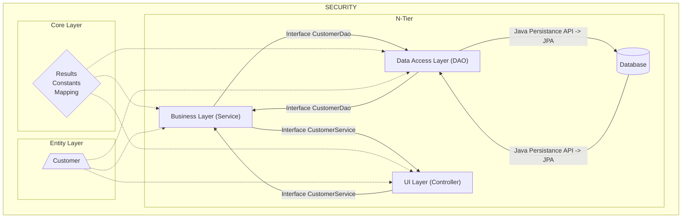

# External microservice

This project was made with **Spring Boot** as a **Microservice**. 
 
 - Project version,                               **Java  8**.
 - package management tool,                      **Maven**,

 - for database access and ORM,                  **JPA Hibernate** 

 - for security,  								**Spring Security** 

This microservice performs basic crud operations as well as sorting, paging, and filtering for customer information.

##  Project details

 
 In this project, n-tier architecture was used. Inter-layer communication was carried out with the interface of each layer. 

 

- **UI layer (Controller)**

 Controller processes requests from the client and returns responses. I injected the interface of the business layer using the dependecy injection pattern and in this way I provided the communication between the two layers.I wrapped all the methods with ResponseEntity. Incoming requests are routed to the business layer, and responses come from the business layer.I added the @RestController annotation to make this layer a restful service.I added @RequestMapping annotation to get incoming requests a common pre-path.I assigned custom routes based on the type of incoming request. According to the type of incoming request, I added @GetMapping @PostMapping @DeleteMapping to the methods and assigned special routes to them.I added a global exception handler to catch validation exceptions. 
 

 
 - **Business layer**
 
 It is the layer where other operations such as logical, arithmetic operations, data manipulation, and control take place. In addition, this layer provides communication between the user interface (controller) and the data access layer.It sends the requests from the controller to the data access layer and returns if there is a response.This layer has a manager class and an interface. It uses the interface to enable communication and as a template.I added an @Service annotation to the manager class to indicate that it is a service class.I wrapped the methods with the result object or subclasses, which is a generic class that I created.Result object; returns data, success status, information message. Customized subclasses of this object are available. All methods can be tracked by log.
 
 
 -  **Data Access layer**
 
  It provides access to the database. It does this by extending the data access layer's existing interface, CustomerDao, with   JpaRepository .
 		
 > **JpaRepository** also provides us with basic crud operations as well as pagination and 	sorting 	methods.
 
 
 
 -  **Entity layer**
 
 It is available in all layers as the program manipulates the entity class. An entity represents an object and a table in a database in Object Oriented Programming. The properties of the entity represent the database columns. The properties of the entity object may not be given directly to the client, or certain properties may be requested from the client. For example ; Properties such as "id" if the client enters a property, and "password" if the client requests properties should be removed from the object.
 These constrained objects are called **DTO** (data transfer objects). For these objects I created a dtos package for the response data in the entity package and a request package for the request data.
 These objects are mapped in the business layer after passing through the controller. I implemented this mapping with the **ModelMapper** library.
  	> In this project, I provided the Object and database relationship with **Spring Data JPA**.
  	
  	
 - **Core layer**
 
  The core layer is usually the code layer that we can use in common in most projects. This 
 
 layer usually provides us with the **DRY** principle and **clean code**, i.e. simpler code. 
 In this layer, I created the **results** package to increase the readability of the API outputs, the **mapping** package for the modelMapper library that does the object-dto-object conversion, the constants package for fixed messages and logging

 - **Security Layer**

This layer is the web security configuration that gives us transaction security. It is necessary to make this microservice accessible to known users. I created a predefined user, defined username and password values in the application.properties file, then assigned those values to properties using **@Value** annotation and **EL ${}**. I created the **SecurityConfig** class in the security suite and extended it with the **WebSecurityConfigurerAdapter** class provided by **Spring Security**. I used **@EnableWebSeucirty** to enable web security. and I overrode the config method that takes parameters of type **AuthenticationManagerBuilder** to identify this user. AuthenticationManagerBuilder provides the inMemoryAuthenticate method. In this method we can define the user and its role and also encode the password. I encoded the password in type **BycrypPasswordEncoder**. I also configured the authorization using the HttpSecurity object with the configuration method that takes HttpSecurity as a parameter. All requests require security and I implemented this by calling the super.configure() method with it set by default.I disabled csrf .

 	
 
 

### What technologies were used?

***********************************************************************************************

  

  
   
	
 

- **Why did I use Spring Boot ?**
 

 > Java Spring Boot (Spring Boot) is a tool that makes developing web application and microservices with Spring Framework faster and easier through three core capabilities: Autoconfiguration. An opinionated approach to configuration. The ability to create standalone applications.
    
   
**************************************************************************************
  

  
   
	
  
- **Why did I use Apache Maven ?** 
	> Apache Maven is a software project management and comprehension tool. Based on the concept of a project object model (POM), Maven can manage a project's build, reporting and documentation from a central piece of information.
   
  
**************************************************************************************

  
   
	
  
  

- **Why did I use Spring Security ?** 
 
 > Spring Security is a powerful and highly customizable authentication and access-control framework. It is the de-facto standard for securing Spring-based applications.

  > Spring Security is a framework that focuses on providing both authentication and authorization to Java applications. Like all Spring projects, the real power of Spring Security is found in how easily it can be extended to meet custom requirements

  **Features**
- Comprehensive and extensible support for both Authentication and Authorization

- Protection against attacks like session fixation, clickjacking, cross site request forgery, etc

- Servlet API integration

 - Optional integration with Spring Web MVC
    > Much more…
   
  
  
************************************************************************************** 

  
   
	
    
 	
 	- **Why did I use Spring Data JPA ?** 
 
 > Speaking precisely, Spring Data JPA is an add-on for **JPA**. It provides a framework that works with JPA and provides a complete abstraction over the **Data Access Layer**.

 > **Spring Data JPA** brings in the concept of JPA Repositories, a set of Interfaces that defines query methods. The Repository and Entity Bean represent the DAO layer in the application. No need to write native queries anymore. Sometimes we need to write queries or part of queries, but those are **JPQL** queries and not native database queries. 

 > **DAO Abstraction (Repositories)**
With Spring Data JPA, we don’t have to write a Data Access Layer or write any SQL statement. Based on JPA specification, the underlying JPA implementation enables the Entity objects and their metadata mapping. It also allows an entity manager responsible for persisting and retrieving entities from the database.

 > The Spring Data JPA defines Repository interfaces with methods for storing and finding the entity beans from the database. While the interface only defines query methods, Spring at runtime provides proxy implementations for the specified interfaces. 
************************************************************************************

 

  
   

   
   - **Why did I use SLF4J ?** 
   
 >  The Simple Logging Facade for Java (SLF4J) serves as a simple facade or abstraction for various logging frameworks (e.g. java.util.logging, logback, log4j) allowing the end user to plug in the desired logging framework at deployment time.
       
      

  
   

   
   - **Why did I use JavaDoc ?** 
   
 > JavaDoc tool is a document generator tool in Java programming language for generating standard documentation in HTML format. It generates API documentation. It parses the declarations ad documentation in a set of source file describing classes, methods, constructors, and fields.
    
   
************************************************************************************************
    
    
  

  
   

   
   - **Why did I use ModelMapper ?** 
   
   > The goal of ModelMapper is to make object mapping easy, by automatically determining how one object model maps to another, based on conventions, in the same way that a human would - while providing a simple, refactoring-safe API for handling specific use cases.    
        
       
******************************************************************************************
   
   

  
   

   
   - **Why did I use Swagger ?**
   
  > Swagger allows you to describe the structure of your APIs so that machines can read them. The ability of APIs to describe their own structure is the root of all awesomeness in Swagger.           
  > Why is it so great? Well, by reading your API’s structure, we can automatically build beautiful and interactive API documentation.
  > We can also automatically generate client libraries for your API in many languages and explore other possibilities like automated testing. 
  > Swagger does this by asking your API to return a YAML or JSON that contains a detailed description of your entire API. 
  > This file is essentially a resource listing of your API which adheres to OpenAPI Specification. The specification asks you to include information like:
What are all the operations that your API supports?
What are your API’s parameters and what does it return?
Does your API need some authorization?
And even fun things like terms, contact information and license to use the API.     
 
  
 
******************************************************************************************
           
      
   

  
   

   
   - **Why did I use PostgreSQL ?**  
   
   

 > PostgreSQL is an advanced, enterprise-class, and open-source relational database system. PostgreSQL supports both SQL (relational) and JSON (non-relational) querying.

 > PostgreSQL is a highly stable database backed by more than 20 years of development by the open-source community.

 > PostgreSQL is used as a primary database for many web applications as well as mobile and analytics applications.   
 
  

 
           
*********************************************************************************************
******************************************************************************************
 
  # Endpoints   

*******************************************************************************
*******************************************************************************    

##### 

 ## **Add Customer** ##
 
 
*******************************************************************************

- **Request**

 ` localhost:4444/api/customer/add `

POST /api/customer/add 

HTTP/1.1

Host: localhost:4444

Authorization: Basic base64(username:password)

Content-Type: application/json

Content-Length: 56

{
    "customerName":"Cem",
    "companyName":"BMW"
}

--------------------------------------------------------
   
  - **Response : SuccesDataResult Object** 
  

	{
	
    
    "success": true,
    
    "message": "customer.added",
    
    "data": {
    
        "id": 9,
        
        "customerName": "Cem",
        
        "companyName": "Ford",
        
        "createTime": "2022-07-21T22:14:14.4192938"
    }
   
  
************************************************************************************************  
 ## **Delete Customer** ##
 ************************************************************************************************ 
 ##### 

- **Request**

 ` localhost:4444/api/customer/deleteById/9  `

DELETE /api/customer/deleteById/9 HTTP/1.1

Host: localhost:4444

Authorization: Basic base64(username:password)

--------------------------------------------------------
   
  - **Response : SuccesDataResult Object** 
  

	{
	
    
    "success": true,
    
    "message": "customer.deleted.by.id : 9",
    
    "data": null
    
}
  
************************************************************************************************
************************************************************************************************  
 ## **get by customer id** ##
 ************************************************************************************************ 
 ##### 

- **Request**

 ` localhost:4444/api/customer/getById/2  `

GET /api/customer/getById/2 HTTP/1.1

Host: localhost:4444

Authorization: Basic base64(username:password)

--------------------------------------------------------
   
  - **Response : SuccesDataResult Object** 
  
{
  
    "success": true,
    
    "message": "customer.found.by.id",
    
    "data": {
    
        "id": 2,
        
        "customerName": "Cem",
        
        "companyName": "32Bit",
        
        "createTime": "2022-07-17T00:55:50.927043"
        
    }

  
************************************************************************************************  
************************************************************************************************  
 ## **filter by company name** ##
 ************************************************************************************************ 
 ##### 

- **Request**

 ` localhost:4444/api/customer/32Bit  `

GET /api/customer/32Bit   HTTP/1.1

Host: localhost:4444

Authorization: Basic base64(username:password)

--------------------------------------------------------
   
  - **Response : SuccesDataResult Object** 
  

	{
	
    "success": true,
    
    "message": "customer.found.by.companyName",
    
    "data": [
    
        {
        
            "id": 1,
            
            "customerName": "Cem",
            
            "companyName": "32Bit"
            
        },
        
        {
        
            "id": 2,
            
            "customerName": "Cem",
            
            "companyName": "32Bit"
            
        }
        
    ]
    
}
  
  
************************************************************************************************  
************************************************************************************************  
 ## **sort by company name** ##
 ************************************************************************************************ 
 ##### 

- **Request**

 ` localhost:4444/api/customer/getAllSortedByCompanyName`

GET /api/customer/getAllSortedByCompanyName HTTP/1.1

Host: localhost:4444

Authorization: Basic base64(username:password)

--------------------------------------------------------
   
  - **Response : SuccesDataResult Object** 
  

	{
	
    "success": true,
    
    "message": "customer.descending.sorted.by.company.name",
    
    "data": [
    
        {
            "id": 1,
            
            "customerName": "Cem",
            
            "companyName": "32Bit",
            
            "createTime": "2022-07-17T00:55:49.813837"
            
        },
        
        {
            "id": 2,
            
            "customerName": "Cem",
            
            "companyName": "32Bit",
            
            "createTime": "2022-07-17T00:55:50.927043"
            
        },
        
        {
        
            "id": 3,
            
            "customerName": "Cem",
            
            "companyName": "Oracle",
            
            "createTime": "2022-07-17T00:56:42.569654"
            
        },
        
        {
            "id": 4,
            
            "customerName": "Cem",
            
            "companyName": "Oracle",
            
            "createTime": "2022-07-17T00:56:43.578356"
            
        },
        
        {
        
            "id": 5,
            
            "customerName": "Cem",
            
            "companyName": "Microsoft",
            
            "createTime": "2022-07-17T01:24:06.895497"
            
        },
        
        {
        
            "id": 6,
            
            "customerName": "Cem",
            
            "companyName": "IBM",
            
            "createTime": "2022-07-20T13:47:51.030206"
            
        },
        
        {
        
            "id": 8,
            
            "customerName": "Cem",
            
            "companyName": "BMW",
            
            "createTime": "2022-07-21T16:07:01.159526"
            
        }
    ]
    
}
************************************************************************************************  
************************************************************************************************  
 ## **list by pagination** ##
 ************************************************************************************************ 
 ##### 

- **Request**

 ` localhost:4444/api/customer/1/6 `

GET /api/customer/1/6 HTTP/1.1

Host: localhost:4444

Authorization: Basic base64(username:password)

--------------------------------------------------------
   
  - **Response : SuccesDataResult Object** 
  

	{
	
    "success": true,
    
    "message": "All customers have listed",
    
    "data": [
    
        {
        
            "id": 1,
            
            "customerName": "Cem",
            
            "companyName": "32Bit"
            
        },
        
        {
        
            "id": 2,
            
            "customerName": "Cem",
            
            "companyName": "32Bit"
            
        },
        
        {
        
            "id": 3,
            
            "customerName": "Cem",
            
            "companyName": "Oracle"
            
        },
        
        {
        
            "id": 4,
            
            "customerName": "Cem",
            
            "companyName": "Oracle"
            
        },
        
        {
        
            "id": 5,
            
            "customerName": "Cem",
            
            "companyName": "Microsoft"
            
        },
        
        {
        
            "id": 6,
            
            "customerName": "Cem",
            
            "companyName": "IBM"
            
        }
        
    ]
    
}

  

  

  

